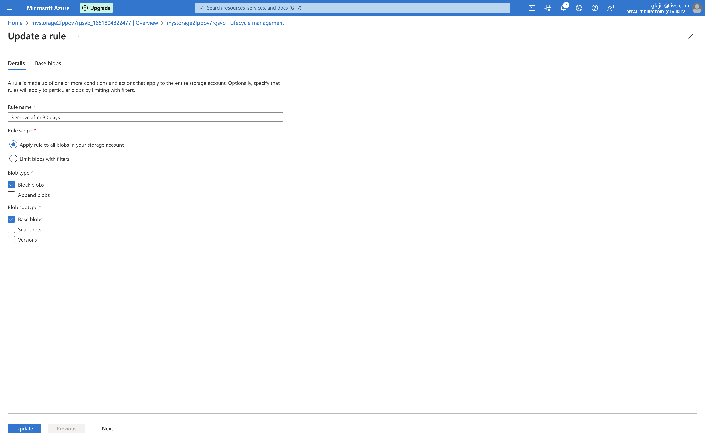

# 02 - Storage Accounts and Virtual Machines

- [Storage Account](#storage-account)
  - [Overview](#overview)
  - [Containers](#containers)
  - [Lifecycle management](#lifecycle-management)
- [Virtual Machines](#virtual-machines)
  - [Overview](#overview-1)
  - [After resize](#after-resize)

## Storage Account

[File in the storage](https://mystorage2fppov7rgsvb.blob.core.windows.net/lesson2/sIttKJs.jpeg)

### Overview

### Containers

### Lifecycle management

## Virtual Machines

### Overview

### After resize

