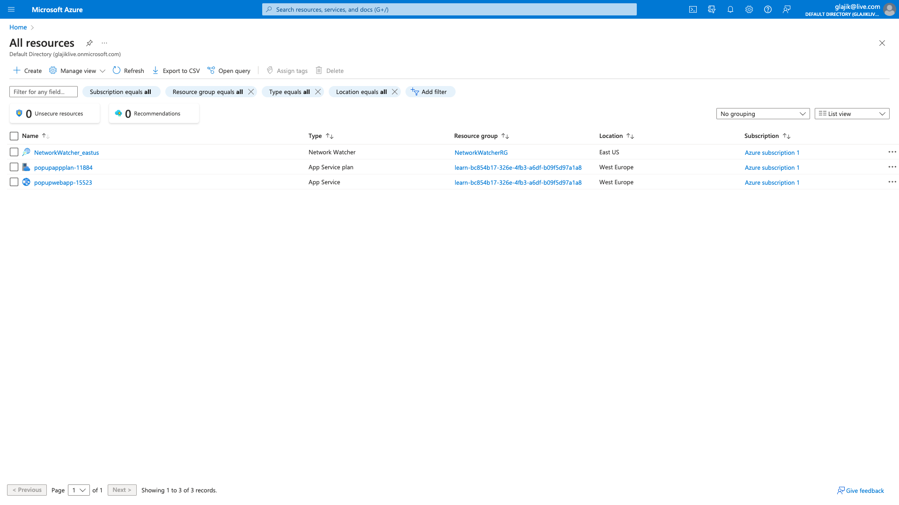
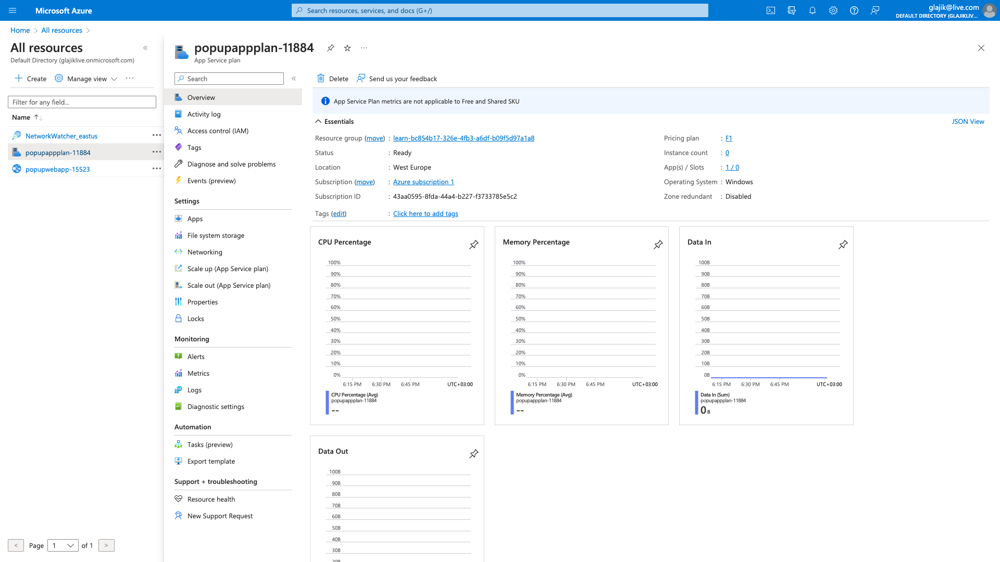
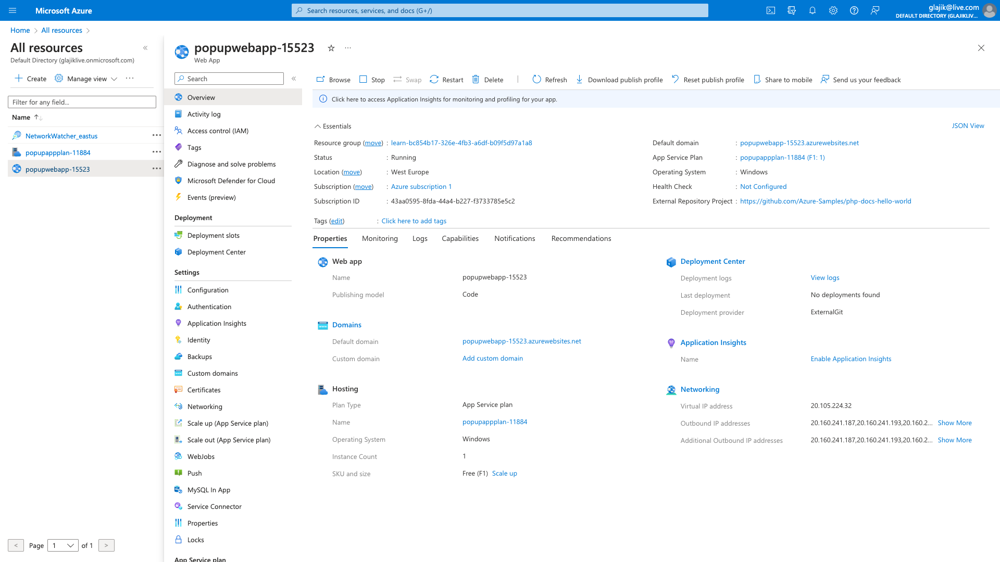
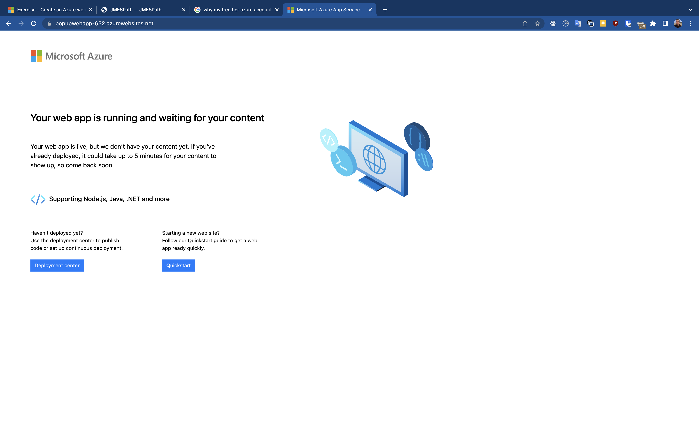

# 03 - Automate Deployments and Configuration of Resources, part 1

  - [Homework](#homework)
    - [Homework results](#homework-results)
      - [1. Text file with command sequences](#1-text-file-with-command-sequences)
      - [2. JSON of created resources (or a screenshot from portal)](#2-json-of-created-resources-or-a-screenshot-from-portal)
      - [3. Text file with commands and output for interesting az cli/powershell commands](#3-text-file-with-commands-and-output-for-interesting-az-clipowershell-commands)
  - [Control Azure services with the CLI](#control-azure-services-with-the-cli)
    - [Using a resource group](#using-a-resource-group)
    - [Steps to create a service plan](#steps-to-create-a-service-plan)
    - [Steps to create a web app](#steps-to-create-a-web-app)
    - [Steps to deploy code from GitHub](#steps-to-deploy-code-from-github)

## Homework

Homework minimum:

- Pick one tool of your choice ( Powershell, az cli, bicep), pick one/ several resources of your choice (vm, vet, storage account etc), deploy the resource with the tool.

Homework maximum:

- Deploy a resource of your choice with each tool;
- Try to work with JMESPath query with az cli commands;
- Try to work with powershell: variables, objects, format output, filter output etc.

### Homework results

#### 1. Text file with command sequences

[bash-az-cli.log](./bash-az-cli.log)

#### 2. JSON of created resources (or a screenshot from portal)

List of created resources:



Service plan:



Web App resource



Deployed Web page:



#### 3. Text file with commands and output for interesting az cli/powershell commands

[interesting-az-cli-commands.log](./interesting-az-cli-commands.log)

## Control Azure services with the CLI

https://learn.microsoft.com/en-us/training/modules/control-azure-services-with-cli

### Using a resource group

Export variables

```bash
export RESOURCE_GROUP=learn-bc854b17-326e-4fb3-a6df-b09f5d97a1a8
export AZURE_REGION=westeurope # centralus
export AZURE_APP_PLAN=popupappplan-$RANDOM
export AZURE_WEB_APP=popupwebapp-$RANDOM
```

Creating a Resource group (if need)

```bash
az group create --name $RESOURCE_GROUP --location $AZURE_REGION --tags purpose=learn_azure
```

List all your resource groups as table

```bash
az group list --output table
```

Output as json using JMESPath

```bash
az group list --query "[?name == '$RESOURCE_GROUP']"
```

http://jmespath.org

### Steps to create a service plan

Get help

```bash
az appservice plan create --help
```

Create an App Service plan to run your app

```bash
az appservice plan create --name $AZURE_APP_PLAN --resource-group $RESOURCE_GROUP --location $AZURE_REGION --sku FREE
```

> I was stuck here because of the quotas for the West US region, until I thought to go to the portal and see the quotas and demand for that region. Then, I re-created Resource group with other region.

Check quota usage:

```bash
az vm list-usage --location "West Europe" -o table
```

> Also I found an issue: https://learn.microsoft.com/en-us/answers/questions/1194443/azure-appservice-error-this-region-has-quota-of-0 and raised a ticket to support.

Verify service plan created

```bash
az appservice plan list --output table
```

### Steps to create a web app

Create web app

```bash
az webapp create --name $AZURE_WEB_APP --resource-group $RESOURCE_GROUP --plan $AZURE_APP_PLAN
```

Verify the app

```bash
az webapp list --output table
```

Check access

```bash
curl $AZURE_WEB_APP.azurewebsites.net # -> a lot HTML
```

Screen of the Web page:


### Steps to deploy code from GitHub

Deploy app from GitHub

```bash
az webapp deployment source config --name $AZURE_WEB_APP --resource-group $RESOURCE_GROUP --repo-url "https://github.com/Azure-Samples/php-docs-hello-world" --branch master --manual-integration
```

Verify

```bash
curl $AZURE_WEB_APP.azurewebsites.net # -> Hello World!
```
