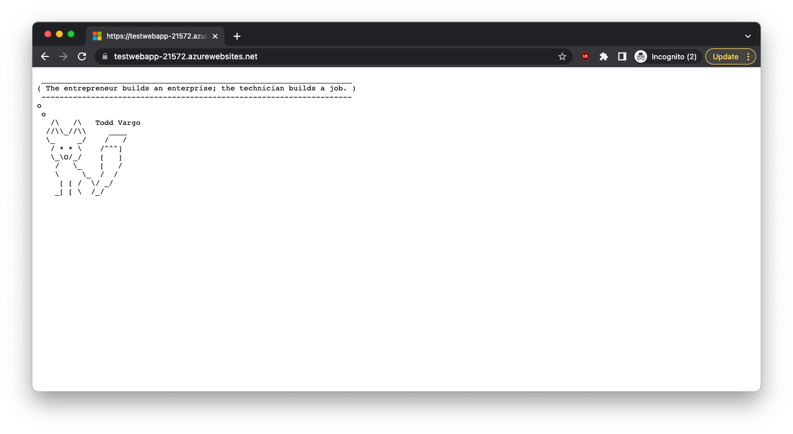
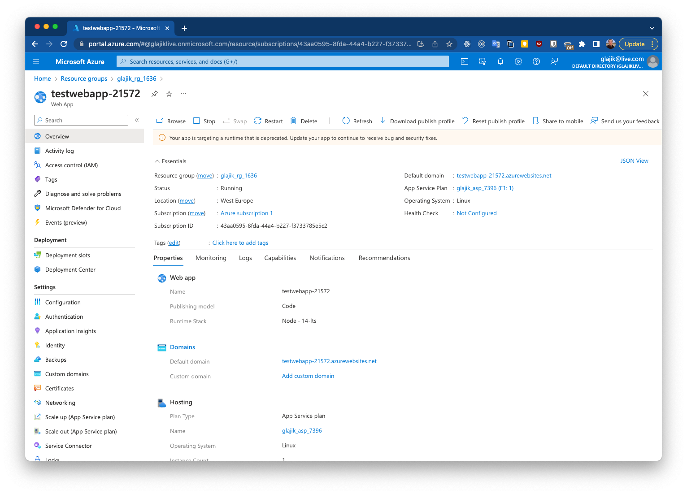
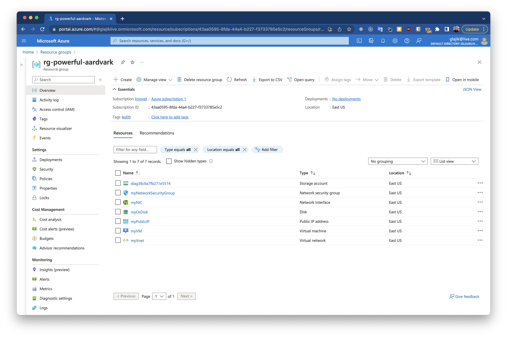
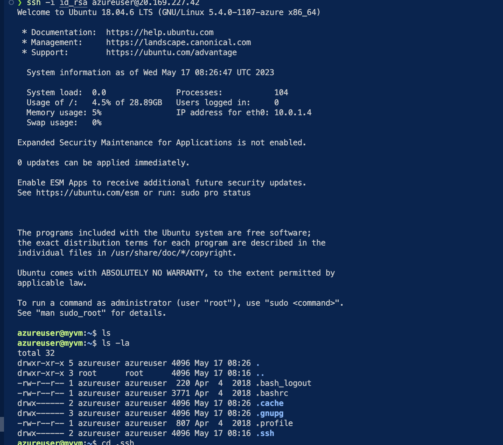

# 05 - Azure App Service and Azure Functions and Terraform Azure

## Homework

- Deploy web app
- Deploy using Terraform

### Deploy Web App

[bash-cli.log](./deploy_webapp/bash-cli.log)

Web App:



Resources view:



### Deploy using Terraform

[bash-cli.log](./deploy_vm_by_terraform/bash-cli.log)

Resources view:



SSH connection:



## Web app

1. Init npm project
2. Add index.js file
3. Write simple http server
4. Add start script to package.json
5. Deploy
6. Wait 5-7 min
7. Verify

```bash
# Deploy
az webapp up --location westeurope --name testwebapp-$RANDOM --sku FREE
```

> Resource group, AppServicePlan, etc. will be created automatically
> Type of deployment (in our case zip) will be recognized by content
> Git init inside the app maybe necessary

- `az webapp up`: webapp up is a feature of the az command-line interface that packages your app and deploys it. Unlike other deployment methods, az webapp up can create a new App Service web app for you if you haven't already created one.

- ZIP deploy: You can use `az webapp deployment source config-zip` to send a ZIP of your application files to App Service. You can also access ZIP deploy via basic HTTP utilities such as curl.

```bash
# Redeploy
az webapp up --resource-group {rg_name} --name {app_name}

# List
az webapp list --output table

# Clean up
az group delete --resource-group {rg_name}
```

## Terraform

- providers.tf – contains data wich allow Terraform to interact with cloud providers, SaaS and other APIs
- main.tf - contains the main set of configuration for your module
- variables.tf - variables to define, can be remote
- output.tf - describe info you need to get back about your infrastructure

### Preparations

```bash
brew tap hashicorp/tap                         
brew install hashicorp/tap/terraform


# In case of this error, you need reinstall xcode CLI tools and
# then, try to install terraform again
# > Error: Your Command Line Tools are too outdated.
# > Update them from Software Update in System Settings.
# > If that doesn't show you any updates, run:
sudo rm -rf /Library/Developer/CommandLineTools
sudo xcode-select --install

# Init terraform in the project folder
terraform init
```

### Setup "Contributor" Role

```bash
# If not already done only
az login

# To get Subscribtion ID
az account list

# Only, if not already set
az account set --subscription="SUBSCRIPTION_ID"

# Creating 'Contributor' role assignment under scope
az ad sp create-for-rbac --role="Contributor" --scopes="/subscriptions/43aa0595-8fda-44a4-b227-f3733785e5c2"

{
  "appId": "e11f3dd6-0aaf-4dab-a669-a63c63ea57c4",
  "displayName": "azure-cli-2023-05-17-07-59-30",
  "password": "8Ye8Q~blablabla~Q7dBpSdFbZP",
  "tenant": "8d3eeb6d-4534-4933-a2f1-019d9e341771"
}

```

### Setup providers.tf

After creating Contributor role you got values below

- appId
- displayName
- password
- tenant

Use this mapping to add values to providers.tf

```t
provider "azurerm" {
  features {}
  
  subscription_id   = "SUBSCRIPTION_ID"
  tenant_id         = "tenant"
  client_id         = "appId"
  client_secret     = "password"
}
```

### Verify and deploy

```bash
# Check output before deploy
terraform plan -out main.tfplan

# Deploy
terraform apply "main.tfplan"

# Get public ip address
terraform output public_ip_address

# Add ssh key
terraform output -raw tls_private_key > id_rsa
chmod 600 id_rsa

# Connect by ssh
ssh -i id_rsa azureuser@<public_ip_address>
```

### Destroy and clean

```bash
terraform plan -destroy -out main.tfplan
terraform apply "main.tfplan" 
```
