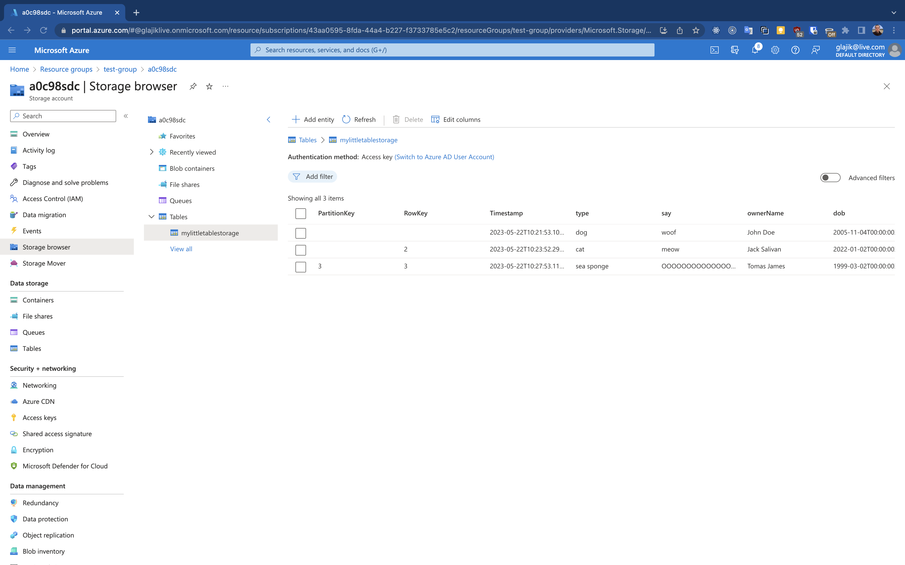
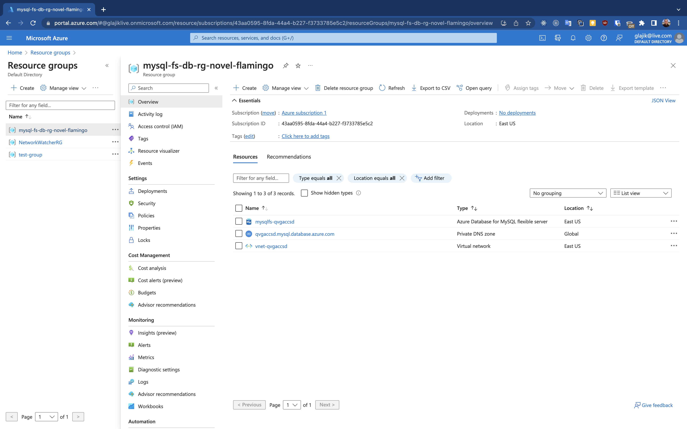
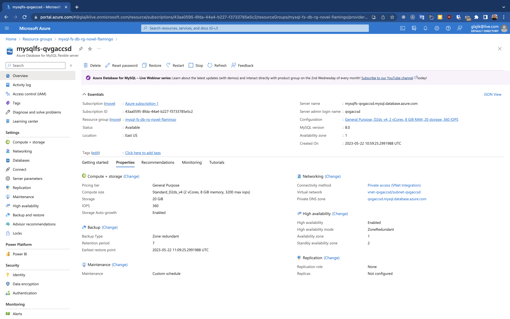

# 06 - Azure Databases Stack

## Homework

1. Deploy new resource Table Storage by portal
2. Deploy Azure SQL Database by Terraform

### 1. Deploy new resource Table Storage by portal

Deployed Table Storage by portal:


### 2. Deploy Azure SQL Database by Terraform

Logs:

- [bash-cli.log](./bash-cli.log)

Verifying:

```bash
# After deploying, I ran the following command:
az mysql flexible-server db show \
    --resource-group mysql-fs-db-rg-novel-flamingo \
    --server-name mysqlfs-qvgaccsd \
    --database-name mysqlfsdb_qvgaccsd

# ... which gave me the output:

{
  "charset": "utf8mb4",
  "collation": "utf8mb4_unicode_ci",
  "id": "/subscriptions/43aa0595-8fda-44a4-b227-f3733785e5c2/resourceGroups/mysql-fs-db-rg-novel-flamingo/providers/Microsoft.DBforMySQL/flexibleServers/mysqlfs-qvgaccsd/databases/mysqlfsdb_qvgaccsd",
  "name": "mysqlfsdb_qvgaccsd",
  "resourceGroup": "mysql-fs-db-rg-novel-flamingo",
  "systemData": null,
  "type": "Microsoft.DBforMySQL/flexibleServers/databases"
}
```

Resource group with Azure SQL Database:


Azure Database for MySQL flexible server:


## Quickstart: Use Terraform to create an Azure Database for MySQL - Flexible Server

https://learn.microsoft.com/en-us/azure/mysql/flexible-server/quickstart-create-terraform?tabs=azure-cli

1. Create a file named providers.tf
2. Create a file named main.tf
3. Create a file named mysql-fs-db.tf
4. Create a file named variables.tf
5. Create a file named outputs.tf
6. Initialize Terraform
7. Create a Terraform execution plan
8. Apply a Terraform execution plan
9. Verify the results
10. Clean up resources

### 9. Verify the results

```bash
az mysql flexible-server db show \
    --resource-group <resource_group_name> \
    --server-name <azurerm_mysql_flexible_server> \
    --database-name <mysql_flexible_server_database_name>
```

### 10. Clean up resources

```bash
terraform plan -destroy -out main.destroy.tfplan
```
