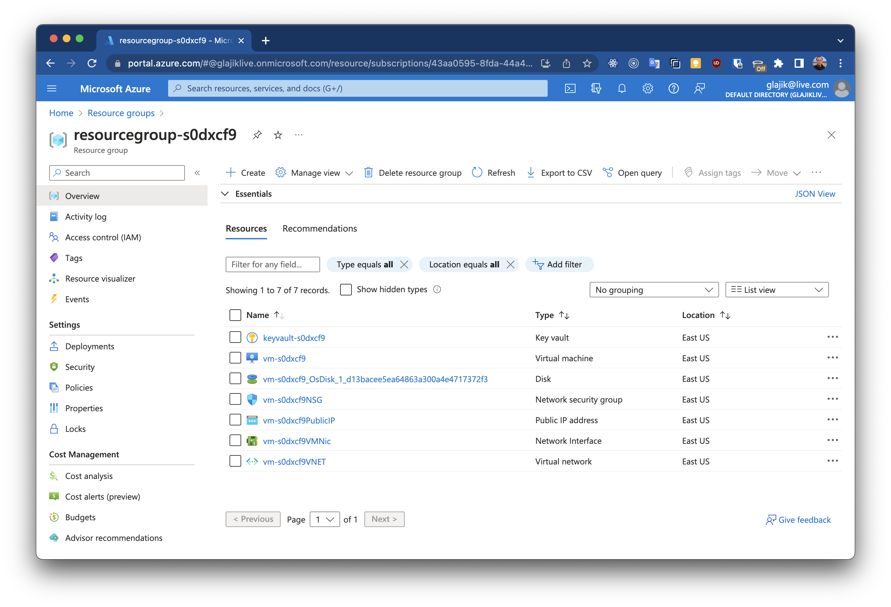
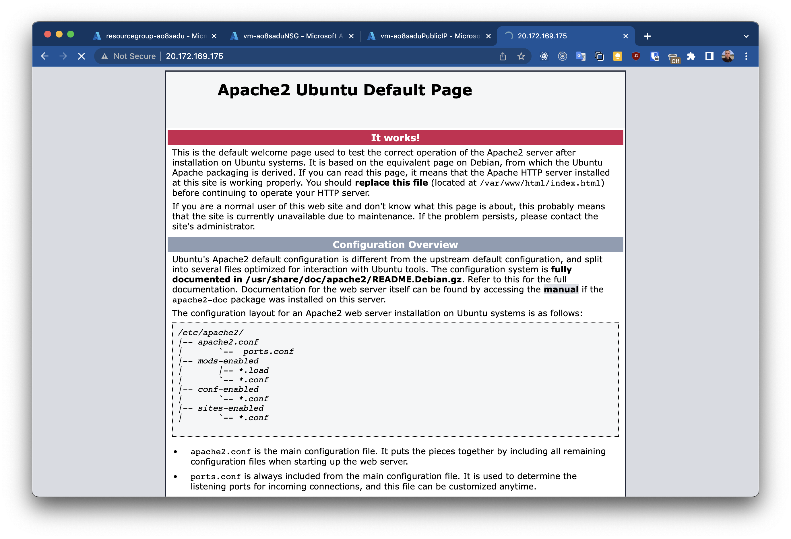
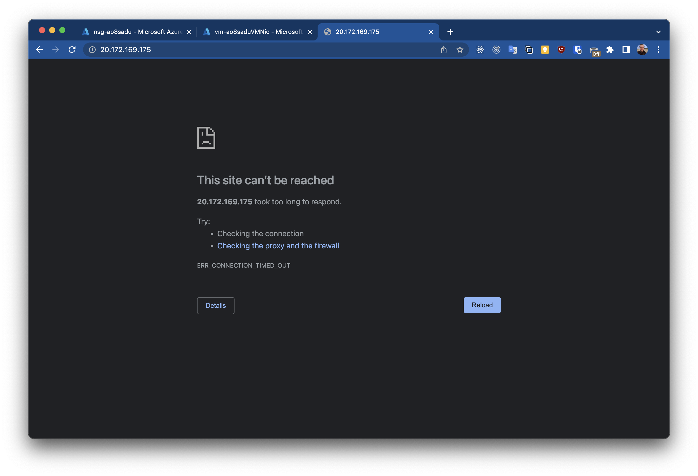
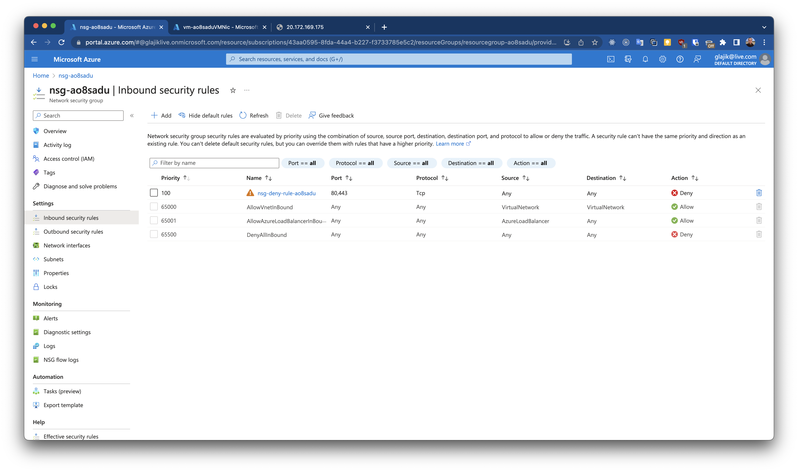

# 07 - Azure Networking and general security and network security features

## Homework

### 1. Create an Azure Key Vault, store a password in it, create a powershell/az cli script that creates a VM with password retrieved from key vault.

Result: commands/script to create objects, create and retrieve secrets/passwords

- [keyvault.ps1](./keyvault.ps1) - Creates a KeyVault, stores the generated password and creates a VM using the password extracted from it.
- [bash-cli.log](./keyvault-bash-cli.log)
- Resource group screen: 

### 2. Create a VM, install/configure a web server (apache, IIS) on port 80 or 443, try to access the page. Then create a NSG with deny rule (tcp 80 /443), apply it to the corresponding subnet or vm interface, try to access the page.

Result: Effective routes output from vm interface with deny tcp 80 rule (screenshot or powershell/az cli output)

- [nsg-vm.ps1](./nsg-vm.ps1) - Creates VM with Apache, set access via 80 port.
- [bash-cli.log](./nsg-bash-cli.log)
- Have access to default Apache page via http before apply restrictions 
- Access denied after restrictions was applied 
- Network Security Group view with deny rule 

## Creating and managing KeyVault

Manage KeyVault keys, secrets, and certificates.

https://learn.microsoft.com/uk-ua/cli/azure/keyvault?view=azure-cli-latest

```bash
# List Vaults and/or HSMs.
az keyvault list

# 
az keyvault create --location westus2 --name MyKeyVault --resource-group MyResourceGroup

az keyvault key list
```

### Reference

- [Secure VM password with Key Vault](https://learn.microsoft.com/en-us/samples/azure/azure-quickstart-templates/vm-secure-password/)
- [Quickstart: Set and retrieve a secret from Azure Key Vault using Azure CLI](https://learn.microsoft.com/en-us/azure/key-vault/secrets/quick-create-cli#add-a-secret-to-key-vault)
- [Parameters in ARM templates](https://learn.microsoft.com/en-us/azure/azure-resource-manager/templates/parameters)
- [How to use Azure Resource Manager (ARM) deployment templates with Azure CLI](https://learn.microsoft.com/en-us/azure/azure-resource-manager/templates/deploy-cli)
- [ARM template best practices](https://learn.microsoft.com/en-us/azure/azure-resource-manager/templates/best-practices#parameters)
- [Quickstart: Set and retrieve a secret from Azure Key Vault using an ARM template](https://learn.microsoft.com/en-us/azure/key-vault/secrets/quick-create-template?tabs=CLI)
- [Tutorial: Integrate Azure Key Vault in your ARM template deployment](https://learn.microsoft.com/en-us/azure/azure-resource-manager/templates/template-tutorial-use-key-vault)

### Howto's

```bash
# Returns "9czgW0KBCEXxZIbbMRaI5aAssoQkXjSEGo3uW6RoC30=" which useful to generate passwords
openssl rand -base64 32
```

## Network Security Groups

### Reference

- [Building an Apache Server on an Azure VM](https://medium.com/@the.nick.miller/building-an-apache-server-on-an-azure-vm-778ae9e59e8a)
- [NSG Overview](https://learn.microsoft.com/en-us/azure/virtual-network/network-security-groups-overview)
- [How network security groups filter network traffic](https://learn.microsoft.com/en-us/azure/virtual-network/network-security-group-how-it-works)
- [Manage network security groups](https://learn.microsoft.com/en-us/azure/virtual-network/manage-network-security-group?tabs=network-security-group-portal)
- [az network nsg](https://learn.microsoft.com/en-us/cli/azure/network/nsg?view=azure-cli-latest)
- [az network nsg rule create](https://learn.microsoft.com/en-us/cli/azure/network/nsg/rule?view=azure-cli-latest#az-network-nsg-rule-create)
- [az network nic update](https://learn.microsoft.com/en-us/cli/azure/network/nic?view=azure-cli-latest#az-network-nic-update)
- [Diagnose a virtual machine network traffic filter problem](https://learn.microsoft.com/en-us/azure/virtual-network/diagnose-network-traffic-filter-problem#diagnose-using-azure-cli)