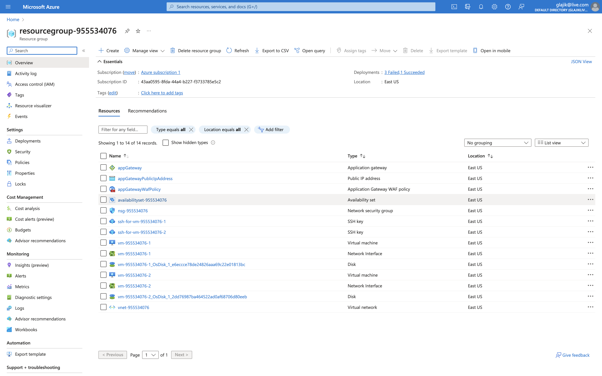

# 08 – Azure Advanced Networking and Load Balancing

## Homework

### 1. Create a setup of 2 vms in an availability set with public LB/AppGateway (choose one or both), test the setup

**Result**:

- [availability-set.ps1](./availability-set.ps1)
- [availability-set-cli.log](./availability-set-cli.log)
- Resource group view: 

### 2. Create 3 vnets, do not exceed 10.0.0.0/16

- VNET1: maximum 255 hosts in future, 3 subnets for 14, 30, 10 hosts respectively, some space for new subnets
- VNET2: maximum 255 hosts in future, 2 subnets for at least 128 hosts each, no new subnets needed
- VNET3: maximum 200 hosts in future, GatewaySubnet /27, 2 more subnets for 5 hosts each
- Create VNET peerings VNET1-VNET2, VNET1-VNET3

Try to allocate minimum IP space, according to requirements

Don’t forget about Azure reserved addresses when calculating vnet/subnet sizes

Result: commands/scripts/screenhsots/bicep/arm template

**NOPE**

## Reference

- [Deploy an Ubuntu VM scale set with Azure Application Gateway](https://github.com/Azure/azure-quickstart-templates/tree/master/quickstarts/microsoft.compute/vmss-ubuntu-app-gateway)
- [Tutorial: Install applications in Virtual Machine Scale Sets with Azure PowerShell](https://learn.microsoft.com/en-us/azure/virtual-machine-scale-sets/tutorial-install-apps-powershell)
- [Create and deploy virtual machines in an availability set using Azure PowerShell](https://learn.microsoft.com/en-us/previous-versions/azure/virtual-machines/windows/tutorial-availability-sets)
- [Load balance your web service traffic with Application Gateway](https://learn.microsoft.com/en-us/training/modules/load-balance-web-traffic-with-application-gateway/)
- [New-AzAvailabilitySet](https://learn.microsoft.com/en-us/powershell/module/az.compute/new-azavailabilityset?view=azps-10.0.0)
- [New-AzApplicationGateway](https://learn.microsoft.com/en-us/powershell/module/az.network/new-azapplicationgateway?view=azps-10.0.0)

### Scale set vs Availability set

- [What is the difference between scale set and availability set in Azure?](https://www.websitebuilderinsider.com/what-is-the-difference-between-scale-set-and-availability-set-in-azure/#:~:text=Scale%20set%20is%20a%20collection,which%20your%20application%20can%20run.)
- [Difference between VM scaleset and Availability set](https://learn.microsoft.com/en-us/answers/questions/984077/difference-between-vm-scaleset-and-availability-se)

On Azure portal I meet this info:

> We recommend that new customers choose virtual machine scale sets with flexible orchestration mode for high availability with the widest range of features. Virtual machine scale sets allow VM instances to be centrally managed, configured, and updated, and will automatically increase or decrease the number of VM instances in response to demand or a defined schedule. Availability sets only offer high availability.
