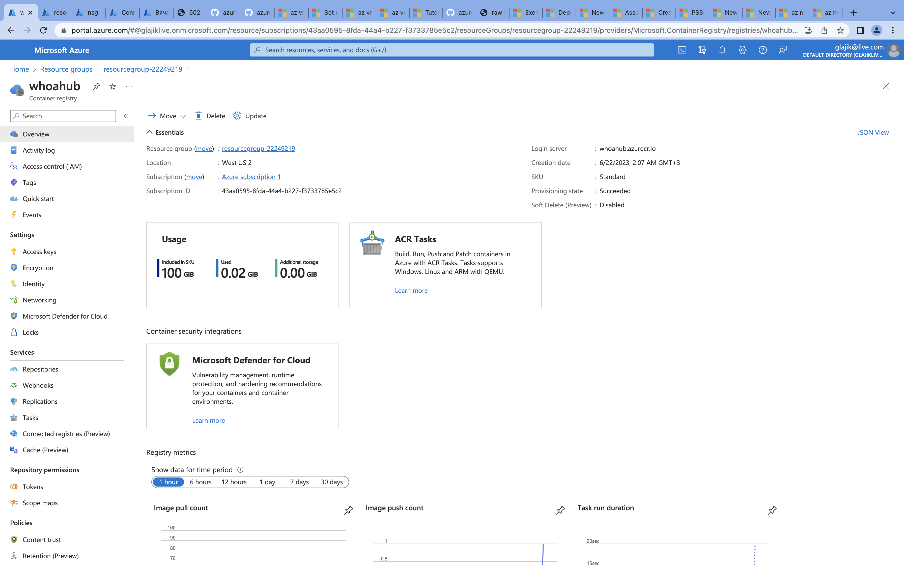
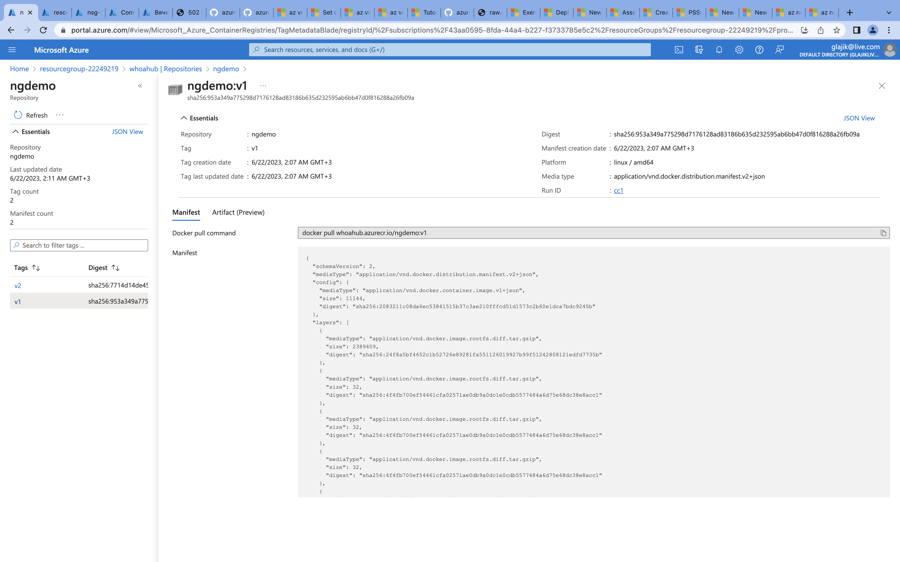

# 09 - Azure Container Instances and Azure Kubernetes Service

## Homework

- Create an Azure Container Registry
- Build and push a container image
- Deploy this image as an Azure Container Instance
- AKS: create and expose a deployment, update image and rollback

DON’T FORGET TO CLEAN UP RESOURCES

Result: commands/scripts/screenshots/bicep/arm template

- [container-instance.ps1](./container-instance.ps1) - Script
- [CLI log](./container-instance-cli.log)
- Azure Container Registry view 
- Repository view 
  