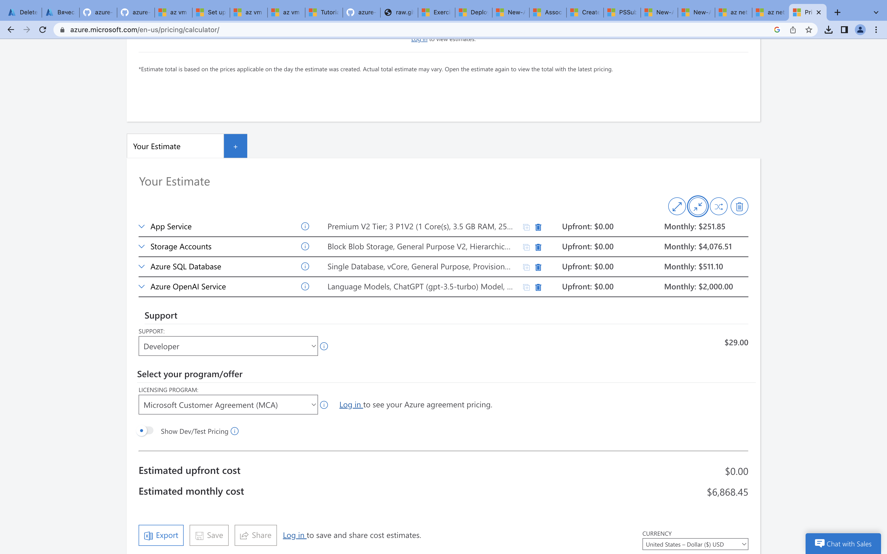

# 10 - Azure management infrastructure, Azure cost management and SLA, Azure identity

## Homework

### 1. Create an estimate with Azure Pricing Calculator

- [ExportedEstimate.xlsx](./ExportedEstimate.xlsx)
- Calculated estimation 

### 2. Create a service principal, auth using az cli or ps with it, run any command

- [principal.ps1](./principal.ps1) - Script
- [CLI log](./cli.log)
